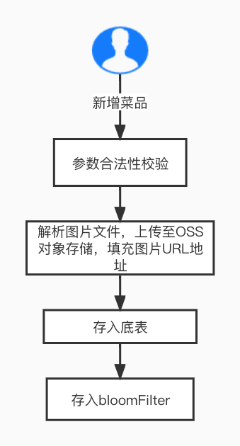

# 外卖点单平台
https://github.com/ChanV233/cvte_waimai
## 需求分析
1. 下单时考虑高并发场景，接口QPS高，直接写入数据库效率低且可能导致数据库崩溃,使用消息中间件达到削峰等效果
2. 考虑缓存与数据库数据一致性问题，需采取相应缓存一致性策略去尽量避免读取到脏缓存
## 技术选型
- 整体框架：SpringCloud + Springboot
- 数据库：Mysql
- 缓存中间件：Redis
- 消息中间件：RocketMQ
- 监控组件：Sentinel
- 权限校验：JWT
- 文件存储：OSS
## 功能模块设计
### 下单模块
#### 流程图

#### 数据库表
```sql
CREATE TABLE `wm_order` (
`order_id` varchar(255) NOT NULL,
`order_detail_list` varchar(255) DEFAULT NULL,
`address` varchar(255) DEFAULT NULL,
`price` decimal(10,2) DEFAULT NULL,
`user_id` int(10) DEFAULT NULL,
`state` tinyint(4) DEFAULT NULL,
`created_time` datetime DEFAULT CURRENT_TIMESTAMP,
PRIMARY KEY (`order_id`)
) ENGINE=InnoDB DEFAULT CHARSET=utf8mb4;
```
```sql
CREATE TABLE `wm_fails_order` (
`order_id` varchar(255) NOT NULL,
`order_detail_list` varchar(255) DEFAULT NULL,
`address` varchar(255) DEFAULT NULL,
`price` decimal(10,2) DEFAULT NULL,
`user_id` int(11) DEFAULT NULL,
`state` tinyint(4) DEFAULT NULL,
`created_time` datetime DEFAULT CURRENT_TIMESTAMP,
PRIMARY KEY (`order_id`)
) ENGINE=InnoDB DEFAULT CHARSET=utf8mb4;
```
#### id生成器
全局唯一、递增、高可用、通过主键保证接口幂等
1. UUID：id随机，影响Mysql性能
2. 雪花算法：依赖于系统时间，可能出现id重复（可人为避免）
3. Leaf：与雪花算法类似，依赖于zookeeper
#### MQ
1. Kafka：性能最高，但强依赖与zookeeper且功能相对单一，更适用于大数据场景
2. RocketMq：性能高、消息可靠、功能完善、有顺序消息、延时消息、事务消息等，可为后续Hold单等业务或接入仓储 、物流模块提供扩展；配套dashboard更加方便对MQ进行监控

#### 压测
接口：/order/producer 
机器配置：4核/16G
压测结果：1500qps、毫秒级响应

### 菜品管理模块
#### 流程图
- 插入菜品

- 获取菜品

- 删除、更新菜品

#### 数据库表
```sql
CREATE TABLE `wm_dish` (
`dish_id` int(11) NOT NULL AUTO_INCREMENT,
`dish_name` varchar(255) DEFAULT NULL,
`image_url` varchar(255) DEFAULT NULL,
`price` decimal(10,2) DEFAULT NULL,
`merchant_id` int(11) DEFAULT NULL,
`is_deleted` tinyint(4) DEFAULT '0',
`created_time` datetime DEFAULT CURRENT_TIMESTAMP,
`updated_time` datetime DEFAULT CURRENT_TIMESTAMP,
PRIMARY KEY (`dish_id`)
) ENGINE=InnoDB AUTO_INCREMENT=4 DEFAULT CHARSET=utf8mb4;
```
#### 缓存一致性方案
1. 延迟双删（最终一致性）
   先删缓存，再删数据库，休眠一段时间后再次删除缓存
   优点：实现简单，不依赖于其他组件
   缺点：有概率出现脏缓存，读取到脏缓存的时间最大为缓存过期时间
2. canal（最终一致性）
   redis伪装成mysql的一个从节点，订阅mysql的binlog，实现数据同步
   优点：代码侵入性小
   缺点：依赖于Mysql集群，主从同步存在延迟，一定概率出现脏缓存
3. 两阶段提交（强一致性）
   删除、更新请求串行执行，执行过程中阻塞所有读请求
   优点：保证缓存与数据库强一致性
   缺点：效率低下

